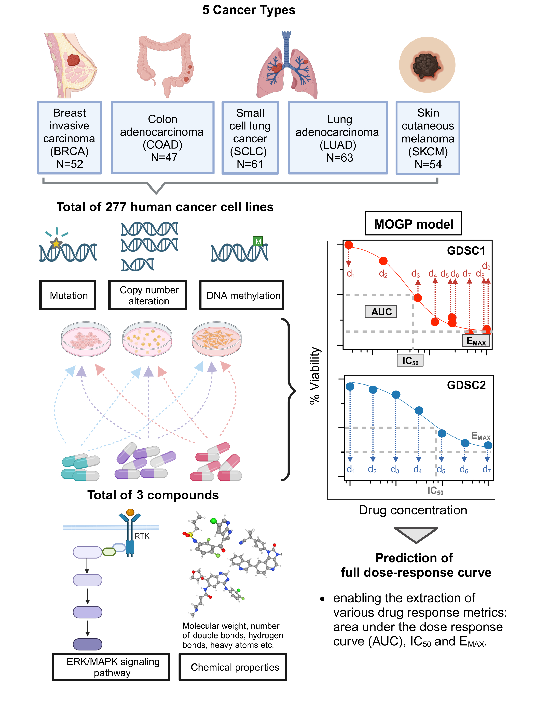
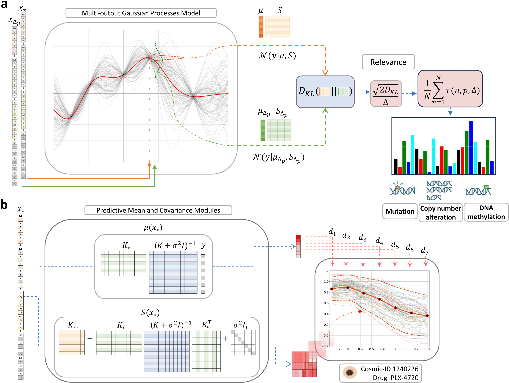

# MOGPs_for_Dose_Response_Predictions

This repository contains an implementation of a Multi-output Gaussian processes (MOGPs) model to predict dose response curves and an implementation of a features relevance determination method based on the Kullback-Leibler divergence. 

The main experiments are presented in: 

- **MOGPTraining_and_KLRelevance_Melanoma_GDSC1_and_GDSC2.ipynb**, in this notebook:

1. We train a MOGP model using the GDSC1 dataset and compute a features ranking by means of the KL-Relevance determination method.
2. We train the MOGP model using the GDSC2 dataset and compute a features ranking via KL-Relevance method.
3. We generate a figure to compare both KL-Relevance rankings obtained with the MOGP models trained on GDSC1 and GDSC2.

- **ExactMOGP_TrainOn_MelGDSC1_ToPredict_MelGDSC2_ANOVAFeatures.ipynb**, in this notebook: 

1. We train a MOGP model using the GDSC1 dataset and then assess the performance of the model using the GDSC2 dataset as testing to obtained the summary metrics: IC50, AUC and Emax.
2. We generate a plot at the end to compare the fitted reference Sigmoid4_parameters function against the MOGP summary metric predictions.

 

Two datasets, GDSC1 and GDSC2, were constructed by consolidating dose-response data for three drugs (Dabrafenib, PLX-4720, SB590885) targeting the ERK/MAPK pathway, on 277 human cancer cell lines sourced from the GDSC database. Both datasets consist of cancer cell lines representing five different cancer types (BRCA, COAD, SCLC, LUAD and SKCM). Molecular features characterising these cell lines (genetic variations, copy number alterations, DNA methylation) and the chemical properties of the three drugs (sourced from PubChem) were also included. These comprehensive datasets served as input for the MOGP model for predicting full dose-response curves and estimating the relative importance of these input features based on KL divergence. 

 

(a) Kullback-Leibler relevance determination to estimate feature importance. To compute the relevance of a feature w.r.t a data observation we have to make two predictions, one for the original observation $x$, and another where such an observation is subtly modified by a small $Δ$ on the $p$-th feature, $x_{Δp}$. The MOGP outputs two distributions, one for input $x$ and another for $x_{Δp}$, then a the $D_{KL}[.||.]$ module computes a divergence between both predictive distributions and then a normalisation applies the operation $2D_{KL}[.||.]/Δ$ to obtain the relevance of the $p$-th feature (see section Kullback-Leibler Relevance Determination for additional details). (b) Prediction of full dose-response curves using MOGP. The input vector $x_*$ is composed of: the cell line genomic features, mutation, methylation and copy number, and the drug compounds. The vector $x_{*}$ feeds two blocks of the MOGP prediction, such blocks generate the mean $\mu(x_{*})$ (red-ish vector) and covariance $S(x_{*})$ (red-ish matrix); both blocks are a pictorial representation of equations (3) and (4). The last panel to the right hand side shows the prediction of a melanoma cancer cell line with Comic-ID: 1240226 from the GDSC2 dataset and treated with PLX-4720. The mean vector $\mu(x_{*})$ has a size of D=7, each of its entries represent the cell viability of the d-th drug concentration (black dots). The covariance matrix $S(x_{*})$ encodes the uncertainty of the prediction; it can (loosely) be expressed as the dashed red line that accounts for a confidence interval of two standard deviations. The multiple coloured functions amongst the dashed red line depict random samples taken from the predictive distribution, $\mathcal{N}(y_{*}|\mu(X_{*}),S(X_{*}))$, to exemplify the stochastic nature of the MOGP prediction.
